```{r, include = FALSE}
knitr::opts_chunk$set(
  collapse = TRUE,
  comment = "#>"
)
```

The present document describes how to process a plantation using the Shiny app. The overall workflow is always the same:  

1. Create a project
2. Load a point cloud
3. Load an Excel database containing the plantation layout
4. Process the point cloud to produce a CHM and a smoothed CHM
5. Align the layout with the real data
6. Detect the trees, and 
7. Measure the trees.

The processing is straightforward, and each page of the app must be run in sequence.

## Main Idea

The natural and state-of-the-art way to measure all trees in a point cloud is to load a point cloud, compute a Canopy Height Model (CHM), and apply an individual tree detection algorithm. Then, in the context of a plantation, with know trees match the detected trees with the trees in the database.

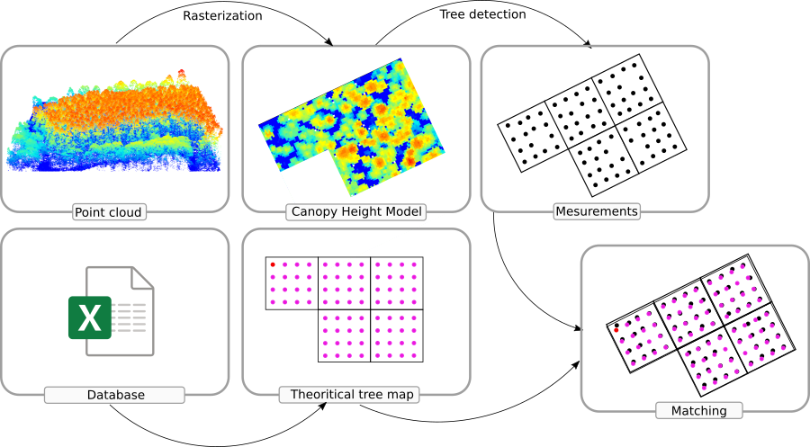

While this solution is the natural approach, it has a weakness: no individual tree detection algorithm is perfect. Some trees may be missing, or worse, some extra trees may be found by the algorithm, which can prevent a robust matching between the automatically detected trees and the database. If more trees are detected than actually exist, or fewer, the matching becomes very difficult, and correct measurements could be assigned to the wrong trees. This can happen more often than desired. In a context where each individual tree is known along with its clone code and other data, misassignments are not acceptable.

Therefore, the problem is approached the opposite way. Instead of detecting trees from the CHM to match the database, we match the database to the CHM and use the hypothetical tree positions as a reference to find the trees.

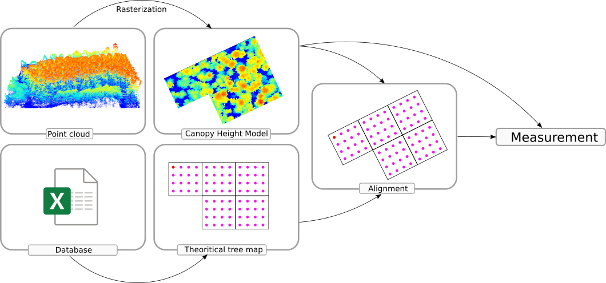

This approach is less natural but guarantees a more robust matching, with errors more easily detectable, as we are 100% certain that the exact number of expected trees is present, allowing for a one-to-one matching.

## Input Standards

This section describes the type of data consumed by the app and how to respect certain standards in order to make everything working and computer readable (especially Excel file).

### Point Cloud

Point clouds must be provided in LAS or LAZ format, which are industry standards. The point cloud **must** be georeferenced, projected, and expressed in meters. Ideally, it **should** have a CRS registered in the metadata. If no CRS is present, the application will display a modal window to manually select one.

### Geospatial Data

The app supports vector data in GeoPackage or Shapefile formats, and raster data in GeoTIFF format. Geospatial data must be provided in the same CRS than the point cloud.

### RBPC's Excel Database

The app reads RBPC's Excel files. Because Excel files are inherently non-standard, their content must be strongly standardized to be properly interpreted by the application.

#### Linear File

The Excel database **must** contain a sheet named `Linear File`, or `Sorted Linear File`, or `Design File`. Case variations are supported (e.g., `design file`). This sheet **must** contain a computer-readable table registering all the trees in the plantation. The Block ID of each tree **must** be recorded in a column named `Pset` (no variation allowed). The position of each tree within its block, represented by a number ranging from 1 to `n`, **must** be recorded in a column named `Tpos` (no variation allowed).

The table **may** contain two columns named `Longitude` and `Latitude`, which record the exact positions of **at least** two trees. If some trees are geolocated, the app automatically applies the algebra-based alignment of the plantation layout, as explained later in this document.

The table **may** also contain a column named `Cut`, `Dead`, or `Removed`, which indicates whether a tree has been removed from the plantation. Note that if a tree is dead but not cut, it is still physically present in the point cloud. This column must be populated with either nothing or `0` for existing trees, and with any **numeric** value other than `0` for cut trees. Labeling cut trees improves alignment, reduces errors, and provides a clearer view of the plantation. Any tree flagged as cut will not be processed. 

If the information is missing or incomplete, it is not a problem, partial information is better than none. If information is missing, the app will still attempt to detect cut trees. However, detection is not 100% accurate, so providing additional information when possible is recommended.

#### Linear Layout

The Excel database **must** also contain a sheet named `Linear Layout Map`, or `Linear Block Map`, or `Block Table`. Case variations are supported (e.g., `Linear layout map`). This sheet **must** contain a computer-readable table registering all blocks in linear format. The Block ID of each block **must** be recorded in a column named `BlockID` or `Pset` (`Pset` should be preferred). The block's position in the grid **must** be recorded in columns named `BlockRow` and `BlockCol` (no variation allowed). Column 1, Row 1 is always at the bottom left. See the figure below for more details. This work must be done manually by an operator, the default trial layout maps from the RPBC's Excel databases being non computer readable.

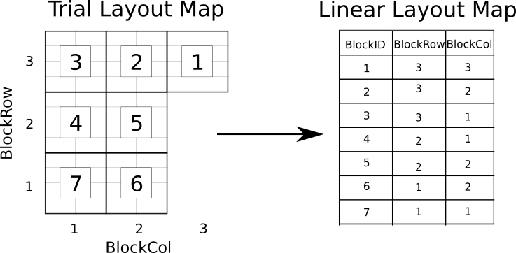{width=75%}

It is possible to represent a non-perfectly aligned block layouts. The `Linear Layout Map` actually records the center of each block. On a well-aligned grid of blocks, those numbers are integers, but decimal numbers are allowed to represent more complex block layouts.

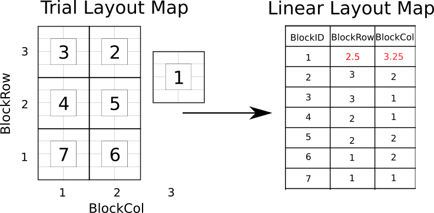{width=75%}

Since this job must be done manually, for a very complex design it might be worth creating a simple grid, letting the app generate the geospatial file, and then editing the file in GIS software later (see the following sections).

Non square blocks are represented the same way. The unit is a block. Block sizes are registered later in the app. At this stage we don't know (and don't care) of block sizes.

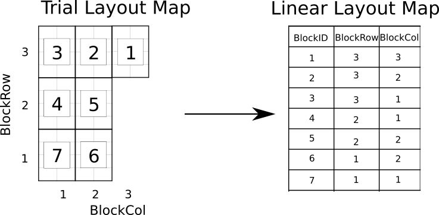{width=75%}

#### Boundaries

The Excel database **may** contain a sheet named `GPS` registering the boundaries of the plantation. **If this sheet exists**, it **must** contain columns named `Longitude` and `Latitude` (`Long` and `Lat` are also accepted) and/or columns named `Easting` and `Northing`. If these columns are present, they **must** be populated with coordinates defining the plantation boundaries. Empty columns will trigger an error. To be computer-readable, the coordinates **must** be ordered to represent a valid polygon that complies with the Simple Feature Standard. The polygon **must not** be explicitly closed; the internal routine will close it automatically. `Easting` and `Northing`, if present, **must** use the same projection as the point cloud. Since Excel files are generic content files, there is no way to register a Coordinate Reference System (CRS), and therefore no standard way to determine in which CRS the coordinates are recorded. For this reason, the app assumes that the coordinates use the same CRS as the point cloud. If `Longitude` and `Latitude` are recorded, they take precedence over `Easting` and `Northing`. This ensures compatibility and avoids potential CRS issues associated with projected coordinates.

## Panel 1: Project

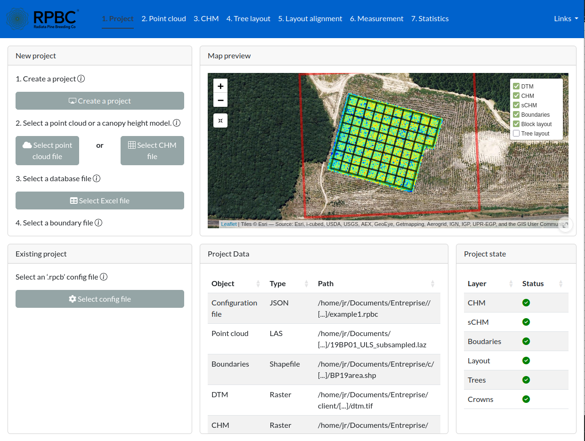{width=100%}

1. Create a project using the `Create a project` button. This creates an `.rpbc` file to save the state of the project and optionally reload later
2. Select a location to save the configuration project (ideally close to the point cloud).
3. Select a point cloud. This updates the preview map at the plantation''s location. The point cloud is not yet loaded into memory.
4. Select an RBPC Excel file. If the database follows the standard, the following happens:
   - The app reads the block layout map and builds an internal map of the blocks.
   - The app reads and loads the tree database.
   - The app reads the `GPS` sheets and builds a spatial vector of the boundaries.
5. If the app fails to read the boundaries, the `Select geospatial file` button can be used to load a geospatial file of the plantation boundaries.


If the RBPC Excel file does not comply with the required standard, the user will receive a (hopefully) informative error message. If the error message is not informative, please report it. If the app crashes, please report it as well.

Having the plantation boundaries is **mandatory**. The `Boundaries` row in the `Project state` table **must** be green before proceeding further.


<blockquote style="background-color: #d6e9f9; border-left: 5px solid #428bca; padding: 10px;font-size: 14px; border-radius: 5px;">
Once the project is set up, the app creates an `output` directory along with the `.rpbc` file. The `output` directory contains all the files and data produced. See the dedicated section for more details.

</blockquote>

## Panel 2: Point cloud

{width=100%}


### Recommended Density 

RPBC's point clouds are extremely (excessively) dense, ranging from 2,000 to 14,000 pts/m². The app only loads a fraction of this data to perform computations. The first card shows the estimated point density and the recommended fraction to load. By default, the cursor is set to this suggested value. The suggestion is calculated as a fraction that targets approximately 200 pts/m². **It is not recommended to change this setting.**

<blockquote style="background-color: #d6e9f9; border-left: 5px solid #428bca; padding: 10px;font-size: 14px; border-radius: 5px;">
In order to compute faster, it is recommended to work with pre-decimated files. Even if the app loads only a fraction of the points, the entire file must still be read. Reading a very large LAZ file can take a long time, which is inefficient when loading only 0.5% of the point cloud. Working with pre-decimated files makes this step feel much faster.
</blockquote>

### Ground Filtering

The ground filtering card allows users to adjust ground point segmentation parameters. **It is not recommended to change these settings.** The internal routine uses the CSF algorithm, which works well with dense drone datasets. Unless the user is familiar with this algorithm, the default settings should be kept. If parameter adjustments are required, users should refer to the `CSF` documentation in the `lidR` package. If bumps in the ground are not properly detected and segmented, we recommend reducing the rigidness and cloth resolution.

If the point cloud already includes ground points (pre-segmented), ground filtering will be skipped and the original classification will be used. This allows classification in external software using other methods.

### CHM Resolution

The last card allows users to adjust the CHM resolution. The default is 10 cm. **It is not recommended to change this setting.**

### Processing

Since all the cursors are *not recommended to change*, the "Point cloud" pane generally requires no user intervention. The user can simply click the `Process` button. The routine will:

1. Load a fraction of the point cloud (this may take some time for very large files).
2. Classify ground points.
3. Build a Digital Terrain Model.
4. Build a Canopy Height Model.
5. Smooth the Canopy Height Model.

The result is then rendered in 3D. The rendering is based on `WebGL`, a technology for interactive 3D scenes in a web page, which has display limitations. To maintain fluid performance, the rendering is limited to 2 million points. For a better rendering, using an external software is recommanded.

## Panel 3: CHM

{width=100%}

The CHM pane allows fine control over CHM smoothing and also provides a way to visualize the DTM. The smoothed CHM has already been produced in the previous step, so there is nothing to do unless the default smoothed CHM shows clear issues. The final smoothed CHM should preserve all tree apexes without losing accuracy from over-smoothing, while still reducing irrelevant variations.

- `CHM smoothing` controls the smoothing window (in meters). A wider window implies more aggressive smoothing.  
- `Smoothing passes` controls how many times the smoothing routine is run. More passes imply more aggressive smoothing.

The defaults are effective. **It is not recommended to change the settings.** However, if the defaults are not satisfactory, the panel offers options to visualize, check, and recompute. Otherwise, the user can proceed to page 4 without intervention.

<blockquote style="background-color: #d6e9f9; border-left: 5px solid #428bca; padding: 10px;font-size: 14px; border-radius: 5px;">
This pane also enable to visualize the DTM to check for potential issues.
</blockquote>

## Panel 4: Tree Layout

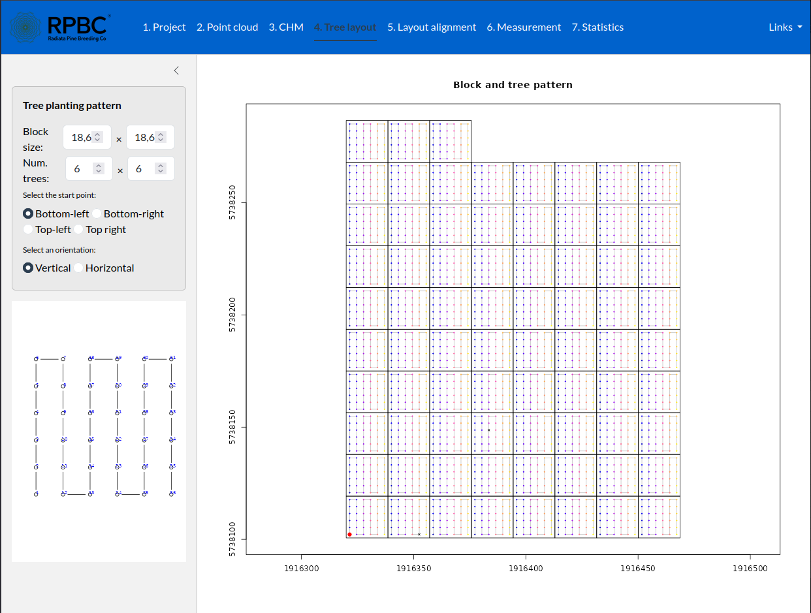{width=100%}

From the RPBC's Excel database, the app produces a map of the blocks and a map of the trees. This pane shows the theoretical position of every single tree. To build an accurate map, the routines need to know the block sizes (default 18.6 x 18.6 m), the number of trees per block (default 6 x 6), and the ordering of the trees within each block. This is controlled by the input fields provided on this pane All this information is expected to be known by the user and is usually recorded somewhere in the database, often in a format that is not computer-readable thus requiring operator intervention to set up the configuration.

Once the layout matches reality, the user can proceed to the next page.

<blockquote style="background-color: #d6e9f9; border-left: 5px solid #428bca; padding: 10px;font-size: 14px; border-radius: 5px;">
Note the red point in the figure. This is the **Tree Zero** (Block 1, Tree 1), which is very important for the next step.
</blockquote>

## Panel 5: Layout alignment

{width=100%}

This is **the most important** pane of the app and the only one that actually requires deep user intervention. The goal is to align the theoretical tree map built from the database with the real trees, in order to automatically pair database entries with measured trees. If a theoretical tree falls between two real trees, there is a chance that an incorrect pairing occurs, assigning the correct measurement to the wrong tree. 

The app does not locate trees automatically. This approach would be prone to few errors, and in the context of the plantation, we cannot afford a single mistake. Instead of automatically detecting trees, the app uses the theoretical layout as a reference and attempts to find and measure the corresponding trees in the Canopy Height Model from the theoretical seed, guaranteeing that each database tree is associated with a real tree without missing a single one and without finding extra ones.

For this process to work, the theoretical map must be very well aligned with the real trees. If a theoretical tree falls between two real trees, there is a risk of assigning the wrong measurement to the database. Therefore, this panel provides tools for automatic and semi-automatic alignment.

<blockquote style="background-color: #ffc5c5; border-left: 5px solid #ff2222; padding: 10px;font-size: 14px; border-radius: 5px;">
The theoretical map does **NOT** need to be perfect. Perfection is achieved through post-optimization, but it should at least be accurate enough to ensure that each theoretical tree lies approximately within the crown of its corresponding real tree.
</blockquote>

### Tree Zero

By default, the plantation layout has no geographic information and is not aligned with real data. It is oriented to the north (this is not alway true but we will discover that later). To align the layout, three parameters are required: x and y translations, and a rotation angle.

To align the layout automatically, the user can click the so-called **Tree Zero** (see previous section) on the map, using the CHM to visually locate it. This provides the x and y translations needed to align the reference tree. Then, by clicking the <kbd>Align trees</kbd> button, the rotation angle is computed automatically, and the x-y translations are slightly optimized to maximize alignment (see figure below)

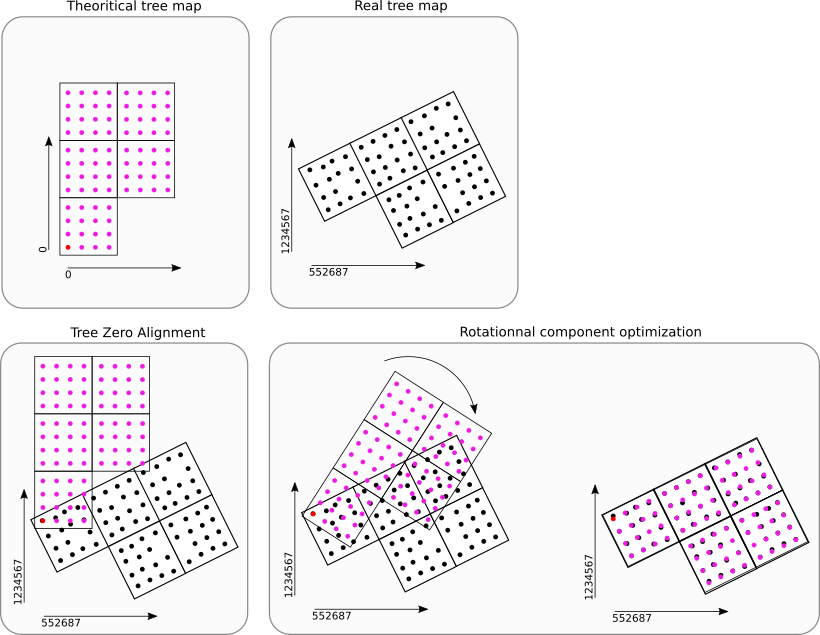{width=100%}

This alignment may not be perfect. It can be exact if the real trees are very well aligned, but if the real trees do not match the theoretical trees, some offsets may be visible. If the discrepancies are small, the <kbd>Optimize by block</kbd> button can further enhance the results.

### Optimize by Block

<kbd>Optimize by block</kbd> performs an additional x-y alignment **for each block**. The previous step applied an overall optimization, while this step fine-tunes the alignment block by block. It may not be perfect either, as the results depend heavily on the accuracy of the real-world plantation.

### Edit Manually

If the "Tree Zero" method fails, the user can align the layout manually by selecting the `Align` mode in the `Edit mode` card. Then, click on the map to edit and move some trees to their correct locations. 

To compute a translation and rotation, a minimum of two properly located trees is mathematically required. Using more trees helps compensate for inaccuracies and improves overall optimization. Placing three trees from three plantation corners is ideal, but any arbitrary trees are mathematically sufficient. 

The app then uses algebra to compute the best translation and rotation to fit the positions provided by the user. This guarantees the best possible fit. However, if the real trees are not perfectly aligned, some errors may still occur (see figure below).


{width=100%}

Block optimization can be performed afterward, but it is also possible to manually adjust individual trees using the `Replace` mode. In this mode, users can move poorly located trees approximately to their correct positions. Perfection is not required at this stage. During post-optimization, each tree will be relocated precisely. The goal is simply to position the trees well enough to prevent any theoretical tree from being paired with the wrong real tree.

### Edit in ArcGIS

If the real plantation is significantly different from the theoretical layout, it may be impossible to align the theoretical map with the real trees, making it impossible to assign the correct measurements to the correct trees. In this case, each tree must be manually located. While this could be done in the app's edit mode, performing extensive edits on an HTML page is cumbersome. Instead, the map can be edited in any GIS software and then reloaded using the <kbd>Select file</kbd> button.

All the files produced by the app can be found alongside the project file in the `output` directory. The plantation layout is `plan_layout.gpkg`.

### Adjustment

The final step, if the alignment is acceptable, is to run a post-optimization adjustment clicking on button <kbd>Adjust trees</kbd>. Each tree from the theoretical layout will be relocated individually to its **exact** position by searching local maxima in the smoothed CHM.

The `hmin` parameter sets a height threshold below which an apex is no longer considered a tree. The default value of 2 m means that any tree shorter than 2 meters will not be considered missing. This allows to detect missing trees.

The map is updated to show how each tree was moved and which trees were actually detected. <span style="color: green;">**Green**</span> trees indicate that an apex was found, these trees are correctly located. <span style="color: red;">**Red**</span> trees indicate that no apex was found and the tree's position is very close to the ground (below `hmin`). These trees are missing and will not be measured, which is acceptable because there is no real tree at that location. <span style="color: orange;">**Orange**</span> trees are critical: no apex was found, but the point is above the `hmin` threshold. These could be missing trees that were not detected or errors, and they require user validation. Editing the map manually may resolve these cases, but most of the time the issue is that the smoothed CHM does not have a local maximum, resulting in a continuous slope up to nearby trees. In this case, the only solution is to decrease the smoothing intensity. However, perfect parameterization is unlikely to be achievable, and the user must accept a small percentage of failures.

{width=100%}

After tree adjustment, the user may see some <span style="color: purple;">**purple**</span> rings. These rings are trigger warnings. According to the layout, the trees are supposed to be planted at specific spacings. However, some trees may not be at the expected locations (misplanted, bent, broken, etc.). The rings indicate trees that are too close to each other. This is not necessarily an error, it may be legitimate, but user validation is required.

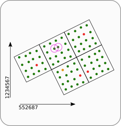{width=33%}

Once the adjustment is satisfactory, the user can proceed to the next pane.

## Panel 6: Segmentation

{width=100%}
This pane perform the segmentation of the trees and measure basic metrics such as crown areas.

The `hmin` parameter sets a height threshold below which a pixel in the **Smoothed** CHM is no longer considered part of a tree crown. Users can adjust this parameter to improve segmentation. Usually this value must be set approximately to the height of the edge of the trees in  the **Smoothed** CHM.

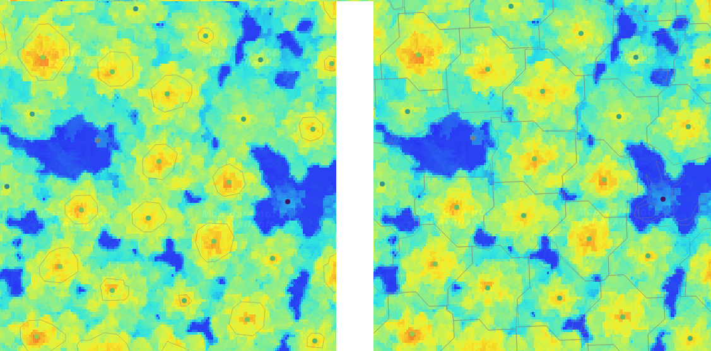{width=100%}
Left: too high `hmin` leads to undersized polygons. Right: with a lower `hmin` polygons are fitting more accurately.

Next, click the <kbd>Measure trees</kbd> button to run the individual tree segmentation.


## Panel 7: Individual Trees

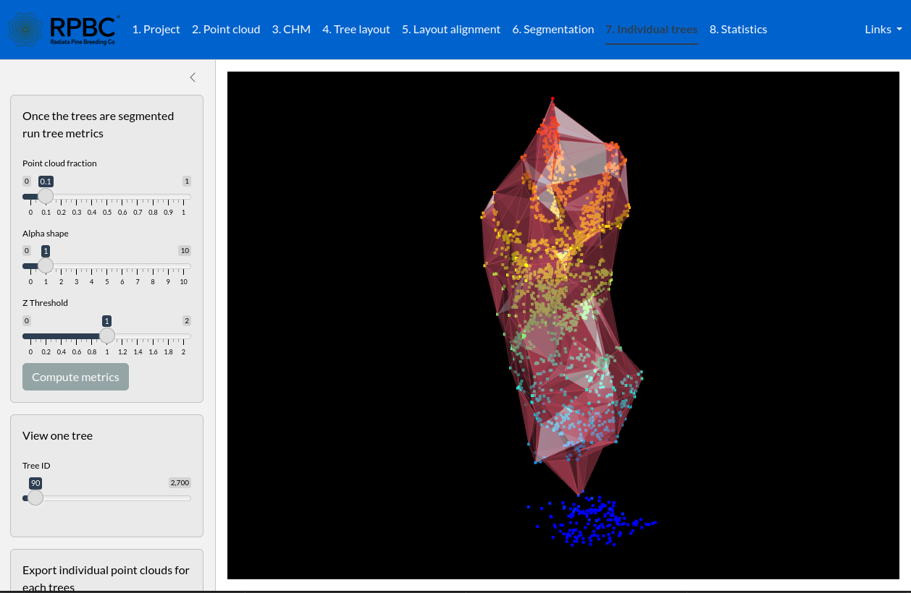{width=100%}

This pane is used to perform operations on individual trees. The first card allows to compute individual tree metrics. The metrics computed for each tree are those from `lidR::stdmetrics`, plus two volume metrics based on the alpha-shape concave hull (from the `alphashape3d` package) and convex hull.

Computing the convex hull and the volume of each hull is very time-consuming. This is why the pane includes a slider called `Point cloud fraction`. This slider enables loading only a fraction of the point cloud and computing the hulls faster **for quick testing purposes**. Hull volumes are highly unstable, and their values significantly decrease with point cloud decimation. Indeed, a single point can have a massive impact on the measured volume. Crown hulls are strongly affected by a single outlying point. We recommend using a fraction of 1 to use all points. However, for quick testing, using 0.1 can save dozens of minutes.

The second slider controls the `alpha` value of the alpha shapes. It is recommended to use `1` but one may want to test other values. Using high values for alpha is equivalent to the computation of the convex hull. The convex hull is already computed internally, thus using `alpha < 5` is recommanded.

The last slider is the most important. It sets a threshold below which points are discarded and not used to compute the hulls and the metrics. Indeed, we may not want to include ground points in the hull and the metrics. This slider controls that threshold (see illustration below).

When the user clicks on <kbd>Compute metrics</kbd> or move the slider `Tree ID`, the point cloud is loaded into memory (not the full point cloud, only the selected fraction). 
When the user clicks on <kbd>Compute metrics</kbd> all metrics are computed. Once the point cloud is in memory, the next card, with the `Tree ID` slider is enabled and allows rendering of a single tree with its concave hull. At this point, moving the sliders `alpha`, `Z threshold`, or `Tree ID` updates the 3D view and displays the effect of the different parameters.

Once the point cloud is loaded in memory, the user has the option to export each tree in the plantation as an individual point cloud using <kbd>Export trees</kbd>.

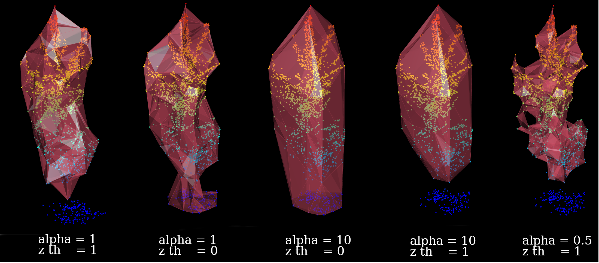{width=100%}


## Panel 8:  Statistics

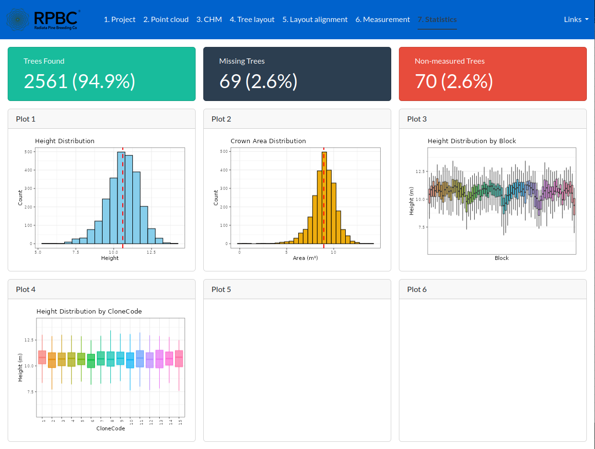{width=100%}

This panel displays several statistics derived from the tree segmentation process. No user intervention is required. The three key figures are:

- **Tree found (green trees):** These trees are correctly detected.  
- **Missing trees (red trees):** These trees are also acceptable, as they are genuinely missing in the real plantation.  
- **Non-measured trees: (orange trees)** Perfect detection is impossible. Typically, 1–3% of trees are not measured. Often, these trees are absent in the real plantation, but the crowns of nearby trees are large enough to confuse the segmentation algorithm. Sometimes, two trees are so close or their crowns so large that two apexes cannot be detected. In such cases, one of the trees cannot be measured. There is not solution. The user must ensure that the measured tree is correctly paired with the correct tree in database.

## Output directory

Along with the `.rpbc` project file, the user will find an `output` directory containing results that can be opened in external software. This directory includes:

- `chm.tif`: the CHM  
- `schm.tif`: the smoothed CHM  
- `dtm.tif`: the DTM  
- `debug.gpkg`: not intended for use; contains the purple circles  
- `plan_layout.gpkg`: a GeoPackage with two layers containing the aligned block and trees  
- `tree_measurements.gpkg`: a GeoPackage with two layers containing measurements of each tree (as points and polygons), along with all their information (clone, family, Pset, Tpos, and all other Excel database attributes)  
- `trees/`: a directory with the point cloud for every individual tree, named after their Pset and Tpos IDs following the naming convention `Pset_{Pset}_Tpos_{Tpos}.las`


